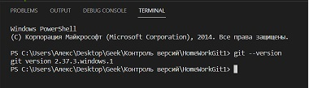
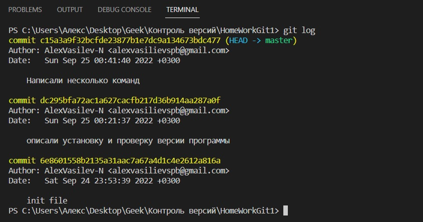

# Инструкция по работе с контролем версий. Git 

## Для чего нужен контроль версий? 
> Возможность ***хранить*** и/или ***возвращаться*** к различным версиям.
Git хранит ***разницу*** между файлами, а не сами файлы. Что в свою очередь упрощает работу с данными и занимает значительно меньше места на диске. 

## Устновка Git. 

> Зайти на официальный сайт (https://git-scm.com/downloads)

1. Выбать необходимую операционную систему
2. Скачать
3. Установить на ПК. 

***После установки необходимо проверить версию программы.
Для этого в терминале нужно ввести команаду:** 
> ***git --version***
***
>> Если программа установлены корректно, то в терминале появиться текущая версия Git. 

***

#  Создаение репозитория Git. 

## Создаем локальную папку. 
***В терминале вводим команду*** 
> **git init**

Данная команда инициализирует папку и начнеть отслеживание изменений. 
    *в папке создастся скрытый файл .git

*Git будет отслеживать все изменения в данном репозитории*

## Проверка статуса репозитория 

> git status 

Данная команда показывает **отслеживаемы и не отслеживаемые файлы**, а также были ли **изменения** в отслеживаемых файлах. 

## Добавление файля для отслеживания

> git add file name.py

Данная команда вводится после добавления (создания) файла в каталог. После git начинает отслеживать изменения в данном файле. 

## Сохаранение изменений 

> git commit 

Команда позволяющая сохранить/записать изменения. 

 **Например**
 >> git commit -m "Текс сообщения" 

 Данна команда зафиксирует изменения в файле. 

## Просмотр изменений.
Для того что бы посмотреть все изменения и комментарии к ним используется команда 
> git log

**Как это будет выглядеть**
>>>
***

## Переход между сохранениями

Для того чтобы вернуться к какомe либо сохранению используется команда:  

> git checkout 

**Например**

> git checkout 